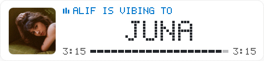

# Build Your Own Apple Music Widget

I wanted a live music widget on my personal website, so I built a self-hosted bridge that sends what is playing in the Music app on my Mac to the web.

Use the included macOS publisher, tiny VPS receiver, and framework-independent widget to build your own version—without integrating MusicKit, creating an Xcode project, or running a centralized service.

```text
Music app on your Mac → self-hosted bridge → your website widget
```

See the idea running on [aliffar.com](https://aliffar.com/#about). The GIF below was recorded directly from the deployed widget.



The pixel-style React widget shown above is now included in this repository, adapted from the real component on my website and made configurable for other people.

> [!IMPORTANT]
> This is a now-playing metadata bridge, not an Apple Music web player. It does not bypass an Apple Music subscription, download audio, or control playback.

## Why this exists

A full Apple Music API integration uses MusicKit identifiers, signed developer tokens, and Apple developer credentials. That is useful when an application needs catalog search or playback, but it is a lot of machinery for a personal “what I am listening to” card.

This project takes a narrower route. It reads the current track from the built-in macOS Music app through read-only Apple Events, publishes that state to an endpoint you own, and renders it on your website.

## What is included

- **macOS publisher:** dependency-free `zsh` scripts and a per-user LaunchAgent.
- **Self-hosted receiver:** a small Node.js HTTP service with Docker Compose and persistent file storage.
- **The aliffar.com React widget:** the animated pixel-style card from the live website, adapted to the public receiver API.
- **Universal widget:** a dependency-free Web Component for plain HTML and non-React sites.
- **VPS examples:** Nginx and Caddy reverse-proxy configurations.
- **Tests and security documentation:** checks for both the local publisher and public receiver.

The components communicate through a [documented, versioned HTTP contract](docs/endpoint-contract.md). You can replace the receiver or widget without changing the Mac publisher.

## Architecture

```text
┌────────────────────────────── Mac ──────────────────────────────┐
│ Music.app → read-only Apple Events → background publisher      │
└───────────────────────────────────┬─────────────────────────────┘
                                    │ authenticated HTTPS POST
                                    ▼
┌────────────────────────────── Your VPS ─────────────────────────┐
│ reverse proxy → receiver → current JSON + current artwork      │
└───────────────────────────────────┬─────────────────────────────┘
                                    │ public HTTPS GET
                                    ▼
                         any website or framework
```

There is no project-operated cloud service. Each user controls their receiver, secret, published data, and website.

## Five-minute VPS setup

### 1. Start the receiver

On a VPS with Docker and Docker Compose:

```sh
git clone https://github.com/aliffrhn/apple-music-widget-bridge.git
cd apple-music-widget-bridge
cp .env.example .env
openssl rand -hex 32
```

Put the generated secret in `.env`, then start the receiver:

```sh
chmod 600 .env
docker compose up -d --build
curl http://127.0.0.1:8787/api/now-playing/health
```

The service listens only on VPS loopback. Add HTTPS using the provided [Nginx](examples/nginx/now-playing.conf) or [Caddy](examples/caddy/Caddyfile) example. The public endpoint should be:

```text
https://example.com/api/now-playing
```

See the complete [VPS self-hosting guide](docs/self-hosting.md).

### 2. Install the Mac publisher

Clone the same repository on the Mac and run:

```zsh
./install.sh --endpoint 'https://example.com/api/now-playing'
```

Enter the same write secret when macOS displays the secure Keychain prompt. The first read may also trigger an Automation permission prompt for the Music app.

Check the installation:

```zsh
"$HOME/Library/Application Support/NowPlayingSync/doctor.sh"
"$HOME/Library/Application Support/NowPlayingSync/sync-now-playing.sh" --once
```

### 3. Add the widget

For React, copy [`widget/react/src`](widget/react/src) into your application and render the real aliffar.com design:

```jsx
import AppleMusicWidget from "./apple-music-widget/AppleMusicWidget.jsx"

<AppleMusicWidget endpoint="/api/now-playing" ownerName="Your name" />
```

Run the complete [React example](examples/react) to see it with demo data:

```sh
cd examples/react
npm install
npm run dev
```

For plain HTML or another framework, copy the universal [`widget/now-playing-widget.js`](widget/now-playing-widget.js) component into the website and load it:

```html
<script type="module" src="/assets/now-playing-widget.js"></script>

<now-playing-widget
  endpoint="/api/now-playing"
  owner-name="Alif"
  refresh-seconds="10"
></now-playing-widget>
```

It works with plain HTML, WordPress, Vue, Svelte, Astro, and other frameworks that support custom elements. See the [widget integration guide](docs/widget-integration.md) for both options.

## Use your own design

The included widget is optional. Any site can read:

```http
GET https://example.com/api/now-playing
```

```json
{
  "schemaVersion": 1,
  "status": "playing",
  "isPlaying": true,
  "title": "Example Song",
  "artist": "Example Artist",
  "album": "Example Album",
  "durationSeconds": 213.4,
  "positionSeconds": 42.1,
  "capturedAt": "2026-08-01T12:00:00.000Z",
  "artworkUrl": "/api/now-playing/artwork?id=0123456789ABCDEF&v=abc123"
}
```

The full schema is in [the endpoint contract](docs/endpoint-contract.md). The public response contains no secret.

## Mac publisher details

The publisher:

- reads title, artist, album, playback state, duration, position, and persistent ID;
- extracts and normalizes current artwork to a web-safe JPEG;
- uploads state changes immediately and heartbeats every 30 seconds while playing;
- runs as a per-user `launchd` agent;
- stores the endpoint configuration with mode `600` and the write secret in macOS Keychain;
- keeps credentials and track metadata out of logs;
- opens no listening port and never controls playback.

Requirements are macOS, the built-in Music app, standard macOS command-line tools, and an HTTPS receiver. The publisher needs no third-party package, `sudo`, Xcode project, code signing, or Apple Music API token.

Read the current local state without uploading:

```zsh
./now-playing.sh
```

Install without artwork publishing:

```zsh
./install.sh --endpoint 'https://example.com/api/now-playing' --no-artwork
```

## Receiver security

The included receiver:

- compares the write secret in constant time;
- accepts state and artwork only through authenticated `POST` requests;
- limits JSON to 64 KiB and artwork to 2 MiB;
- validates the state schema and JPEG signature;
- rejects stale events and artwork for a previous track;
- writes persistent files atomically;
- returns public data with ETags and short caching headers;
- drops container capabilities and uses a read-only container filesystem.

Keep the receiver behind HTTPS, bound to VPS loopback, and never put the write secret in frontend code. Read [SECURITY.md](SECURITY.md) before publishing listening activity.

## Repository layout

```text
.
├── now-playing.sh                 local Music reader
├── artwork.sh                     local artwork reader
├── sync-now-playing.sh            authenticated publisher loop
├── install.sh / uninstall.sh      macOS lifecycle
├── doctor.sh                      installation diagnostics
├── receiver/                      standalone HTTP receiver and tests
├── widget/react/                  real pixel-style aliffar.com React widget
├── widget/now-playing-widget.js   universal Web Component
├── examples/react/                runnable React example
├── examples/nginx/                Nginx reverse proxy
├── examples/caddy/                Caddy reverse proxy
├── docs/                          protocol and setup guides
└── compose.yaml                   self-hosted receiver stack
```

## Development and tests

Publisher checks require macOS:

```zsh
./tests/run.sh
```

Receiver and widget tests require Node.js 22 or newer:

```sh
cd receiver && npm test
cd ../widget && npm test
cd react && npm test
cd ../../examples/react && npm ci && npm run build
```

See [CONTRIBUTING.md](CONTRIBUTING.md) for contribution guidance.

## Limitations

- The publisher is macOS-only and reads the Music app on the same Mac.
- A self-hosted receiver or compatible hosted adapter is still required.
- The default receiver stores only the current state and artwork, not listening history.
- The included widgets use polling rather than a persistent Realtime connection.
- Album artwork can be copyrighted; each operator is responsible for how it is displayed.
- Music, Apple Music, and MusicKit are Apple trademarks. This independent project is not endorsed by Apple.

## Uninstall the Mac publisher

```zsh
./uninstall.sh
```

This removes only the integration's LaunchAgent, installed scripts, private state, logs, configuration, and Keychain item. It does not use `sudo` or remove unrelated files.

## License

[MIT](LICENSE)
